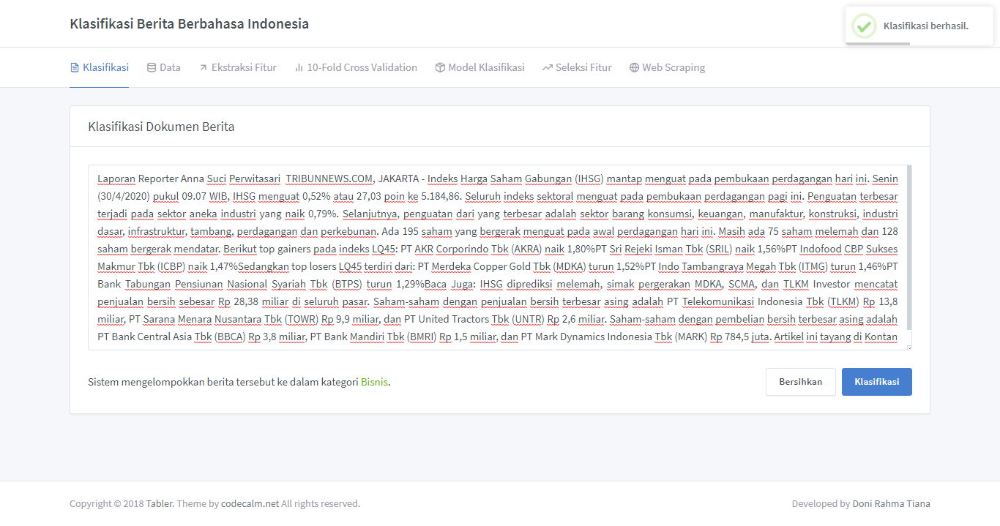
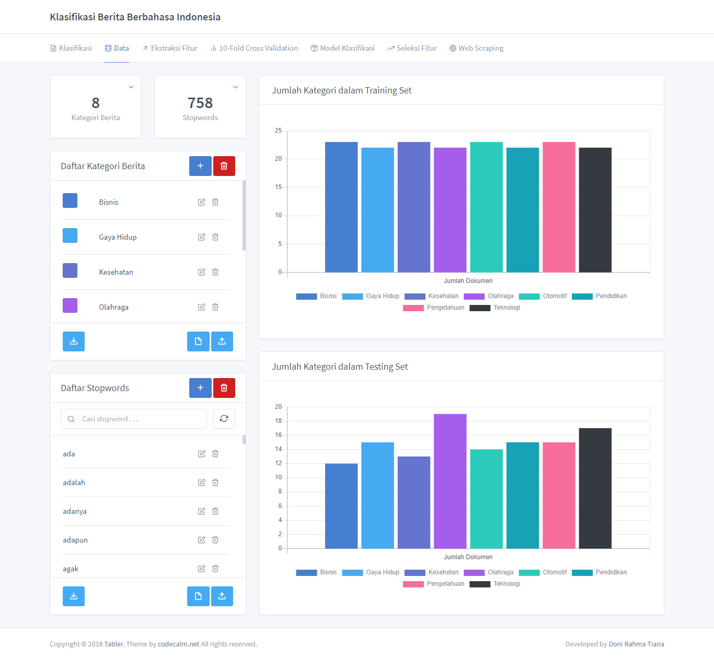
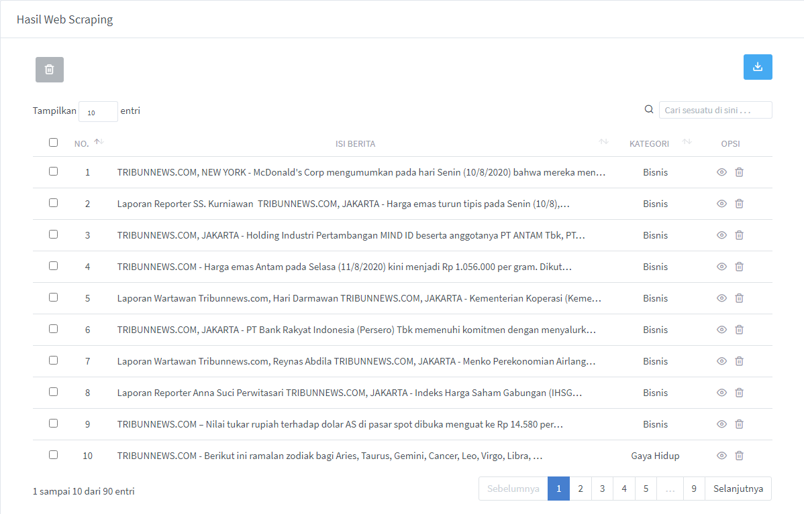
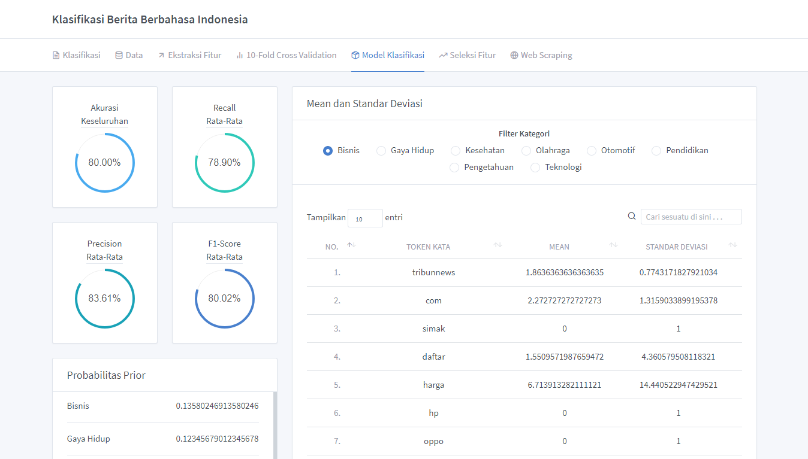
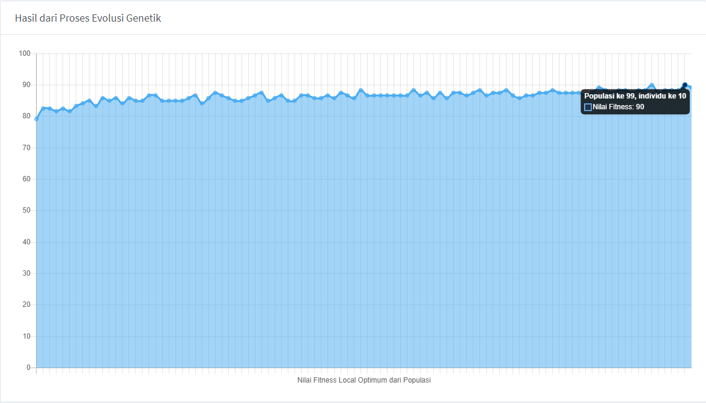
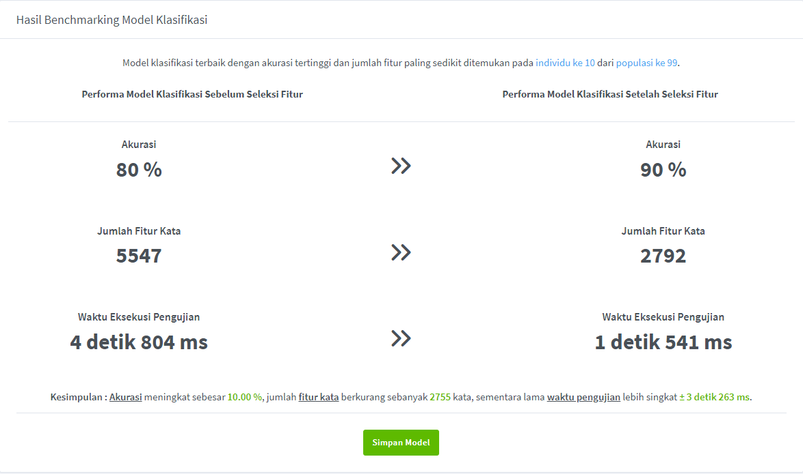
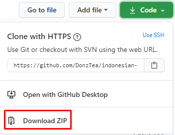

# Klasifikasi Berita Berbahasa Indonesia Menggunakan Algoritma Naive Bayes dengan Seleksi Fitur Algoritma Genetika

Aplikasi ini merupakan implementasi dari machine learning (from scratch) menggunakan algoritma klasifikasi Naive Bayes dan teknik seleksi fitur algoritma genetika dalam kasus klasifikasi berita berbahasa Indonesia.

## Contoh antarmuka aplikasi








## Disclaimer

Sebelum menggunakan aplikasi ini, perlu diingat bahwa aplikasi ini hanya saya gunakan dalam penelitian skripsi saya. Dalam pembuatan aplikasi ini, saya baru mengenal Express.js dan langsung melakukan implementasi program sehingga source codenya masih belum bisa dikatakan clean code, namun secara fungsi saya rasa hasilnya cukup layak dan memuaskan.

## Requirement

1.  npm v6.14.6
2.  Node.js v13.3.0
3.  MongoDB v4.2.3

## Prerequisite

1. Familiar dengan command prompt / terminal.
2. Mengerti cara melakukan clone project / download zip source code dari Github.

## Instalasi

Ada dua cara instalasi yang saya uraikan, silakan gunakan cara yang dirasa nyaman dan familiar. Bagi yang terbiasa dengan perintah git, silakan gunakan [cara pertama](#instalasi-dengan-cara-clone-git-repository). Jika tidak familiar dengan git, bisa gunakan [cara kedua](#instalasi-dengan-cara-download-zip).

### Instalasi dengan cara clone git repository

1. Pada command prompt / terminal, eksekusi perintah berikut ini :

```
git clone git@github.com:DonzTea/indonesian-news-classification-with-web-scraper.git
```

2.  Masuk ke folder yang telah di-clone tersebut dengan perintah :

```
cd indonesian-news-classification-with-web-scraper
```

3.  Install library yang diperlukan beserta dependency-nya dengan perintah:

```
npm install
```

4.  Rename file `.env.example` menjadi `.env`
5.  Buka file tersebut, lalu sesuaikan environment variabel didalamnya seperti yang diinginkan, kemudian save.

### Instalasi dengan cara download zip

1. Download source code dalam bentuk zip dengan cara klik tombol code, kemudian klik download zip seperti gambar di bawah ini.

<p align="center">
  
</p>

2. Extract file zip yang telah didownload.
3. Buka command prompt / terminal, masuk ke direktori dimana folder yang telah diextract tadi berada.
4. Install library yang diperlukan beserta dependency-nya dengan perintah:

```
npm install
```

5.  Rename file `.env.example` menjadi `.env`
6.  Buka file tersebut, lalu sesuaikan environment variabel didalamnya seperti yang diinginkan, kemudian save.

## Menjalankan aplikasi

1.  Start server MongoDB.
2.  Start server Express.js menggunakan command `npm run start`. (Apabila ingin mengaktifkan watch mode untuk keperluan development, gunakan command `npm run dev`)
3.  Buka browser, kemudian akses `http://localhost:3000`.

## Tutorial penggunaan aplikasi

Sebelum menggunakan aplikasi, ada beberapa hal yang harus dilakukan sebelum sistem dapat melakukan klasifikasi. Sistem ini menggunakan algoritma machine learning sehingga memerlukan model klasifikasi yang dihasilkan dari serangkaian proses. Hal itulah yang menjadi sebab mengapa saya menguraikan tutorial cara penggunaannya.

Berdasarkan beberapa pertimbangan, akhirnya saya putuskan untuk mengupload tutorial penggunaan aplikasinya di youtube supaya secara visual langsung terlihat dan dapat dijelaskan secara langsung. Tutorial penggunaan aplikasinya dapat diakses di url berikut ini : [https://youtu.be/5wxUEAsiyAw](https://youtu.be/5wxUEAsiyAw)

## Hal baru yang saya pelajari

- Klasifikasi dalam machine learning
- Algoritma klasifikasi Naive Bayes
- K-fold cross validation
- Teknik seleksi fitur algoritma genetika menggunakan metode elitism selection
- Memilah dataset yang baik untuk digunakan
- Menggunakan framework Express.js
- Menggunakan template engine ejs
- Melakukan teknik AJAX menggunakan library axios
- Mengimplementasikan websocket dengan library socket.io
- Mengetahui dan menghormati rule dari robots.txt target web scraping dengan menetapkan jeda waktu setiap kali scrape berjalan supaya tidak memberatkan server target
- Melakukan teknik web scraping dengan melakukan rotasi proxy untuk meminimalisir terblokirnya IP yang kita gunakan dari target web scraping
- Melakukan web scraping dengan library puppeteer sebagai web automation untuk melakukan scrape list elite proxy dan url target berita
- Melakukan web scraping dengan library cheerio sebagai scraper data dari dokumen berita
